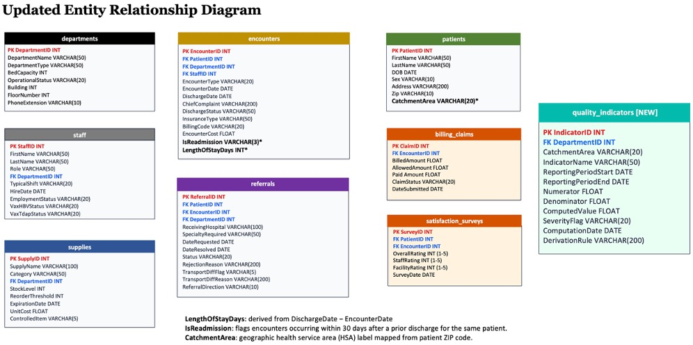

# Hospital Operations Management Database

A relational database (MySQL) modeling a district hospital's operations, with a reporting layer and stored procedure that automate recurring quality-indicator reporting. Built and iteratively expanded across three design phases, then extended with an R visualization layer.

> All data in this project is synthesized for demonstration. No real patient information is used.

## Overview

District hospitals often lack centralized systems for tracking operations, supplies, and performance. This database models that environment and supports three user roles — a supply and pharmacy manager, an infection control officer, and a regional health department supervisor — through analytical queries and an automated reporting layer used for accreditation.

## Schema

The database contains **9 tables**: `departments`, `staff`, `supplies`, `patients`, `encounters`, and `referrals` (core operations), `billing_claims` and `satisfaction_surveys` (revenue-cycle and patient-experience reporting), and `quality_indicators` (a reporting layer populated by the stored procedure).

Derived fields support performance measures: `LengthOfStayDays` and `IsReadmission` on `encounters`, and `CatchmentArea` (ZIP mapped to health service areas) on `patients`.

## What this project demonstrates

- **Relational design:** a normalized multi-table schema with primary and foreign keys, entity relationships, and an ERD; iteratively expanded as new reporting needs emerged.
- **Derived measures:** length of stay, 30-day readmission flags (date-windowed self-join), claim-denial and revenue-loss metrics, and patient-satisfaction gaps.
- **Advanced querying:** aggregation with `CASE`, multi-table joins, a `RANK()` window function for per-department cost ranking, and a multi-stage common table expression (CTE) query classifying patients into chronic-disease risk tiers.
- **Automation:** a parameterized stored procedure (`ComputeQualityIndicators`) that validates a reporting period, clears prior results to support reruns, and computes four indicators — 30-day readmission rate, first-encounter complication rate, bed-utilization rate, and provider-workload index — writing them to the reporting table.

## Files

| File | Contents |
|------|----------|
| `schema.sql` | Table definitions, foreign keys, and synthesized data (9 tables) |
| `queries.sql` | Role-based analytical queries |
| `advanced_queries.sql` | Schema extensions, aggregate and window-function queries, CTE risk-classification query |
| `stored_procedure.sql` | `ComputeQualityIndicators` procedure, execution call, and results query |
| `ERD.jpg` | Entity relationship diagram |
| `r_visualizations.html` | Rendered R analysis (DBI/RMariaDB): quality-indicator dashboard and chronic-disease priority map |

## Tools

MySQL, MySQL Workbench. An R layer (tidyverse, ggplot2, patchwork; DBI/RMariaDB) visualized the computed indicators as an accreditation dashboard and a chronic-disease priority map.
